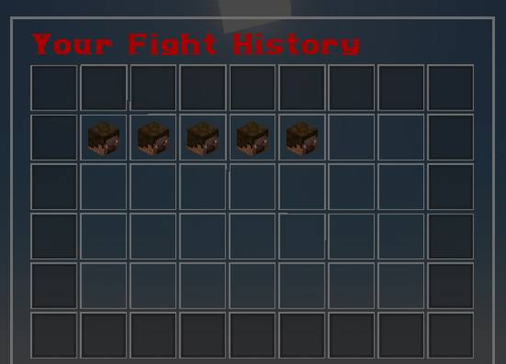
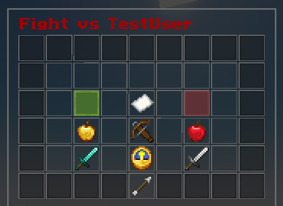
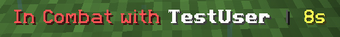
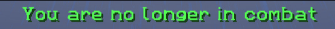

# CombatLens

CombatLens is a Minecraft PvP analytics plugin for Paper servers. It records every fight between players and lets them review a detailed breakdown afterward, right from an in-game GUI.

No external dashboard, no web panel. Just walk away from a fight and check exactly what happened.

## Status

**Release — ready to use.**

CombatLens has moved past beta. The core tracking system, GUI, combat tag, and configuration are stable and tested on Paper 1.21.x.

## What it does

When two players fight, CombatLens quietly tracks the entire exchange in the background. Once the fight ends — by a kill, a disconnect, a logout, or simply going quiet for too long — the fight is saved to that player's history, viewable anytime with a single command.

### Fight History GUI


Run `/combatlens` (or `/cl`) to open your fight history. Each entry shows a quick summary: who you fought, how it ended, what weapon you used, where it happened, and how long it lasted.

Click any entry to open the full breakdown:

- **Combat** — hits landed and missed, critical hits, best hit, total and average damage, longest combo, healing done
- **Shield** — blocks made, whether the shield broke
- **Consumables** — golden apples, enchanted golden apples, totems popped, and every potion effect active during the fight
- **Ranged combat** — arrows shot and landed, ender pearls thrown, for both players
- **Gear** — weapon used, sharpness and protection levels, XP level and hunger at the start of the fight
- **Timeline** — start time, end time, total duration

Every stat is shown side by side for both you and your opponent.


### Combat Tag

While in combat, an action bar timer shows who you're fighting and how much time is left before the fight times out. The timer turns red in the final seconds as a warning. Fights that end this way are recorded as a timeout rather than a kill or disconnect.





### Smart filtering

Fights that last only a couple of seconds — a single accidental hit, for example — aren't saved. Only fights that meet a minimum duration are recorded, keeping history meaningful instead of cluttered.

### Commands

| Command | Description |
|---|---|
| `/combatlens` | Open your fight history GUI |
| `/combatlens stats` | Quick text summary of your overall record |
| `/combatlens help` | List available commands |

Aliases: `/cl`, `/combat`

## Configuration

Server admins can adjust behavior in `config.yml`:

```yaml
combat:
  timeout: 15            # seconds without a hit before a fight ends
  min-fight-duration: 5  # fights shorter than this aren't saved
  max-history: 10        # fights stored per player

combat-tag:
  enabled: true           # toggle the action bar timer

messages:
  in-combat: "In Combat with {player}"
  out-of-combat: "You are no longer in combat"
```

## Data storage

Fight history is stored locally in a SQLite database inside the plugin's data folder. Nothing is lost on server restart, and no external database setup is required.

## Requirements

- Paper 1.21.x
- Java 21+

## Installation

1. Download the Download the [latest release](https://github.com/ItsRavensLand/CombatLens/releases/latest)
2. Drop it into your server's `plugins` folder
3. Restart the server
4. Done — CombatLens starts tracking fights automatically

## License

No license has been specified yet. All rights reserved unless stated otherwise.
